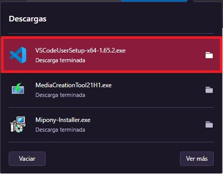

# <b>Visual Studio Code </b>
<cite style="display:block; text-align: justify">[Visual Studio Code][1_0] es un editor de código fuente desarrollado por Microsoft para Windows, Linux, macOS y Web. Incluye soporte para la depuración, control integrado de Git, resaltado de sintaxis, finalización inteligente de código, fragmentos y refactorización de código. También es personalizable, por lo que los usuarios pueden cambiar el tema del editor, los atajos de teclado y las preferencias. Es gratuito y de código abierto,1​2​ aunque la descarga oficial está bajo software privativo e incluye características personalizadas por Microsoft.</cite>

[1_0]:https://es.wikipedia.org/wiki/Visual_Studio_Code

[1_1]:https://code.visualstudio.com/download

 

# <b>Descarga e instalación de Visual Studio Code </b>
<cite style="display:block; text-align: justify">Lo primero que haremos es ir a la página oficial de [Visual Studio Code][1_1] y descargar el instalador, en este momento se encuentra disponible la version 1.65, en esta pagina nos muestra una serie de opciones para descargar el intalador dependiendo del sistema opertaivo en el cual estemos trabajando.

En nuestro caso nosotros trabajamos con Windows en 64 bits, en ese caso le daremos clic donde dice "User Installer" </cite>

 

<cite style="display:block; text-align: justify">Una ves descargado el Visual Studio Code lo ejecutamos.</cite>

<cite style="display:block; text-align: justify">En esta ventana tendremos que aceptar los Términos de licencia del software, una ves aceptemos del acuerdo le damos en el botón de siguiente</cite>

<cite style="display:block; text-align: justify">En esta parte, nos indica donde se va instalar el programa y nos da la posibilidad de asignarle una ubicación personalizada, en nuestro caso lo dejaremos así y le daremos en el botón de siguiente.</cite>

<cite style="display:block; text-align: justify">Luego nos saldrá esta ventana donde se nos pondrá el acceso directo del programa, lo dejaremos tal cual y le daremos en el botón de siguiente</cite>

<cite style="display:block; text-align: justify">En esta ventana solo le daremos en el botón de siguiente</cite>

<cite style="display:block; text-align: justify">Nos saldrá esta ventana donde nos da un resumen de donde se instalara el programa, el acceso directo y las tareas adicionales que ejecutara; le damos al botón de Instalar para continuar.</cite>

<cite style="display:block; text-align: justify">Una ves le demos a Instalar, el programa empezara hacer el proceso correspondiente.</cite>

<cite style="display:block; text-align: justify">Una ves termina la instalación nos saldrá esta ventana donde nos indica una opción la cual va a ejecutar el Visual Studio Code al darle al botón de Finalizar (Si no queremos que lo ejecute al Finalizar podemos quitarle el "visto" a la Opción).</cite>

<cite style="display:block; text-align: justify">Esto será lo que nos saldrá al momento de terminar con la instalación del programa.</cite>

