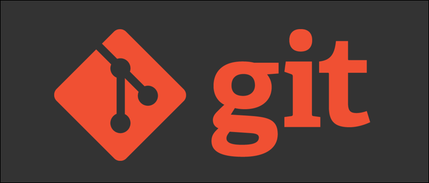
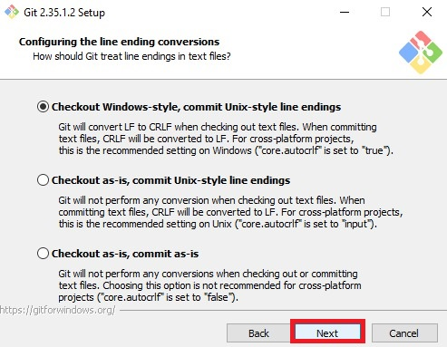
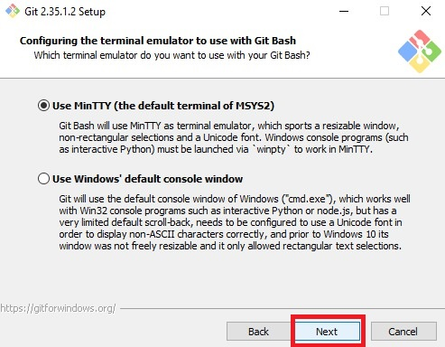
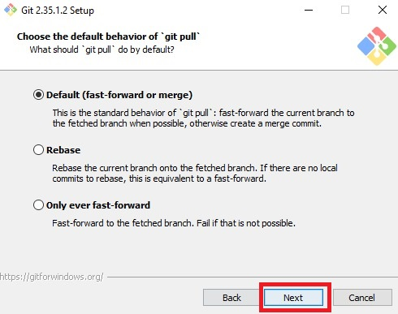
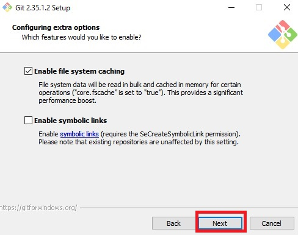

# <b>Git </b>
<cite style="display:block; text-align: justify">[Git][1_0] es un software de control de versiones diseñado por [Linus Torvalds][1_2], pensando en la eficiencia, la confiabilidad y compatibilidad del mantenimiento de versiones de aplicaciones cuando estas tienen un gran número de archivos de código fuente. Su propósito es llevar registro de los cambios en archivos de computadora incluyendo coordinar el trabajo que varias personas realizan sobre archivos compartidos en un repositorio de código.

Al principio, Git se pensó como un motor de bajo nivel sobre el cual otros pudieran escribir la interfaz de usuario o front end como Cogito o StGIT. 2​Sin embargo, Git se ha convertido desde entonces en un sistema de control de versiones con funcionalidad plena. 3​Hay algunos proyectos de mucha relevancia que ya usan Git, en particular, el grupo de programación del núcleo Linux.</cite>

[1_0]:https://es.wikipedia.org/wiki/Git

[1_1]:https://git-scm.com/downloads

[1_2]:https://es.wikipedia.org/wiki/Linus_Torvalds

 

# <b>Descarga e instalación de Git</b>
<cite style="display:block; text-align: justify">Lo primero que haremos es ir a la página oficial de [Git][1_1] y descargar el instalador, en este momento se encuentra disponible la version 2.35.1.

Nos ubicamos en el instalador del sistema operativo en el que estemos trabajando, en nuestro caso descargaremos el de Windows.</cite>

 

<cite style="display:block; text-align: justify">Nos pregunta el instalador que queremos descargar, en nuestro caso descargaremos la de 64 Bits.</cite>

<cite style="display:block; text-align: justify">Una vez descargado el instalador del Git, lo ejecutamos, en caso de pedir permiso de administrador le decimos que si y continuamos.</cite>

<cite style="display:block; text-align: justify">Nos saldrá esta ventana, donde le daremos al botón de Next.</cite>

<cite style="display:block; text-align: justify">Aquí nos indica la carpeta donde se va a instalar el programa, para continuar le daremos nuevamente al botón de Next.</cite>

<cite style="display:block; text-align: justify">En esta ventana le daremos en el botón de Next para continuar con la instalación.</cite>

<cite style="display:block; text-align: justify">Acá nos muestra la dirección donde se pondrá el acceso directo del programa, para continuar le daremos al botón de Next.</cite>

<cite style="display:block; text-align: justify">En esta ventana le daremos al botón de Next para seguir con la instalación.</cite>

<cite style="display:block; text-align: justify">De aqui en adelante dejaremos seleccionadas las opciones que bienen por defecto y le daremos clic al botón Next.</cite>

