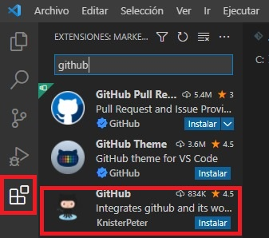

# <b>Sincronización de Visual Studio Code y Github </b>

<cite style="display:block; text-align: justify">Visual Studio Code (VS Code) se ha convertido en uno de los editores más populares que existen para el desarrollo web. Ha conseguido tanta popularidad gracias a sus muchas funciones integradas, incluyendo la integración del Control de código fuente. Aprovechar el poder de Git desde VS Code puede hacer que su flujo de trabajo sea más eficiente y robusto.

 

Como sabemos, Git y GitHub no son lo mismo, Git es nuestro sistema local de gestión de versiones y tiene la posibilidad de integración con otras plataformas como GitHub. Mediante la plataforma de social coding GitHub puedes publicar repositorios de código en remoto. De esta forma podremos trabajar con un sistema de control de versiones en la nube.

Este sistema te ofrece la posibilidad de colaborar en otros proyectos y publicar los tuyos propios. La plataforma es de código abierto por defecto, por lo que cualquier persona puede utilizar tu código y tú también puedes ver el código de otros proyectos.</cite>

# <b>Usar Github y Visual Studio Code para publicar contenido</b>

<b>Crear cuenta en Github</b>

<cite style="display:block; text-align: justify">Accede a [github.com][1_0] y crea una cuenta. 

Selecciona el plan personal gratuito con repositorio público, no te olvides de terminar la verificación mediante correo electrónico.

Crea un proyecto en la opción “Create repository” o en «Start a New Project». Incluye el nombre de tu repositorio, selecciona «Public» y pincha el botón “Create repository”. No cierres esta ventana porque vas a necesitar algunos de los datos que ahí se muestran para clonar el repositorio mediante URL. </cite>

 

[1_0]:https://github.com

<b>Clonar el repositorio con Visual Studio Code</b>

<cite style="display:block; text-align: justify">Antes de comenzar a clonar el repositorio debemos instalar Visual Studio Code y Git, Lo cual ya hemos hecho anteriormente.

Una vez instalado Git, en cualquier sistema operativo, podemos comprobar que el programa se ha instalado correctamente comprobando el número de versión desde línea de comandos.</cite>

 

 

<cite style="display:block; text-align: justify">A continuación, debemos definir nuestro usuario e email, para eso utilizaremos los siguientes comandos.</cite>

 

 

<cite style="display:block; text-align: justify">Mediante esta configuración, ya podremos realizar los commits de nuestros proyectos.</cite>

<cite style="display:block; text-align: justify">Vamos a la parte extensiones y buscamos <b>Github</b>, nos saldrá un listado de extensiones disponibles, Seleccionaremos la resaltada acontinuación y le daremos instalar.</cite>

