# <b>Sincronización de Visual Studio Code y Github </b>

<cite style="display:block; text-align: justify">Visual Studio Code (VS Code) se ha convertido en uno de los editores más populares que existen para el desarrollo web. Ha conseguido tanta popularidad gracias a sus muchas funciones integradas, incluyendo la integración del Control de código fuente. Aprovechar el poder de Git desde VS Code puede hacer que su flujo de trabajo sea más eficiente y robusto.

 

Como sabemos, Git y GitHub no son lo mismo, Git es nuestro sistema local de gestión de versiones y tiene la posibilidad de integración con otras plataformas como GitHub. Mediante la plataforma de social coding GitHub puedes publicar repositorios de código en remoto. De esta forma podremos trabajar con un sistema de control de versiones en la nube.

Este sistema te ofrece la posibilidad de colaborar en otros proyectos y publicar los tuyos propios. La plataforma es de código abierto por defecto, por lo que cualquier persona puede utilizar tu código y tú también puedes ver el código de otros proyectos.</cite>

# <b>Usar Github y Visual Studio Code para publicar contenido</b>

<b>Crear cuenta en Github</b>

<cite style="display:block; text-align: justify">Accede a [github.com][1_0] y crea una cuenta. 

Selecciona el plan personal gratuito con repositorio público, no te olvides de terminar la verificación mediante correo electrónico.

Crea un proyecto en la opción “Create repository” o en «Start a New Project». Incluye el nombre de tu repositorio, selecciona «Public» y pincha el botón “Create repository”. No cierres esta ventana porque vas a necesitar algunos de los datos que ahí se muestran para clonar el repositorio mediante URL. </cite>

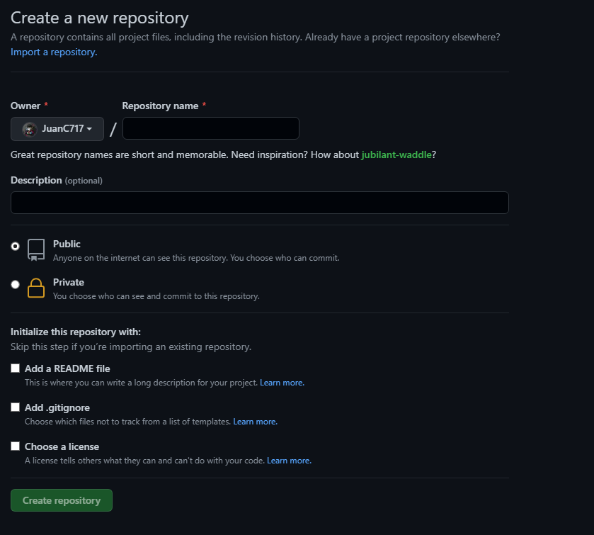 

[1_0]:https://github.com

<b>Clonar el repositorio con Visual Studio Code</b>

<cite style="display:block; text-align: justify">Antes de comenzar a clonar el repositorio debemos instalar Visual Studio Code y Git, Lo cual ya hemos hecho anteriormente.

Una vez instalado Git, en cualquier sistema operativo, podemos comprobar que el programa se ha instalado correctamente comprobando el número de versión desde línea de comandos.</cite>

 

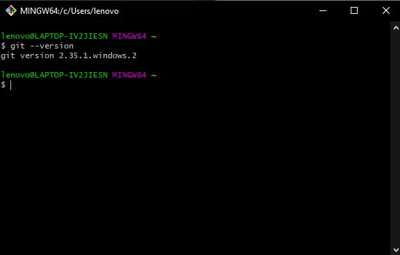 

<cite style="display:block; text-align: justify">A continuación, debemos definir nuestro usuario e email, para eso utilizaremos los siguientes comandos.</cite>

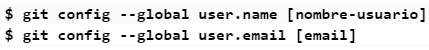 

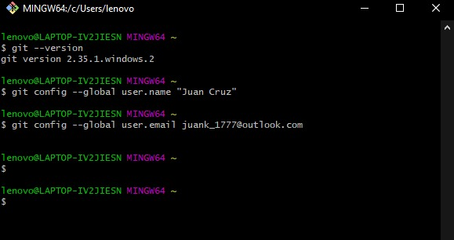 

<cite style="display:block; text-align: justify">Mediante esta configuración, ya podremos realizar los commits de nuestros proyectos.</cite>

<cite style="display:block; text-align: justify">En el programa de Visual Studio Code vamos a la parte inferior izquierda le vamos a dar en "Activar sincronización de configuración..." con esto vamos a poder sincronizar nuestra cuenta de Guthub al Visual Studio Code. </cite>

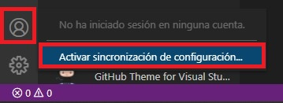

<cite style="display:block; text-align: justify">Nos saldrá esta ventana donde dejaremos tal cual esta y le daremos en Iniciar sesión y activar.</cite>

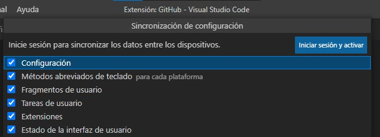

<cite style="display:block; text-align: justify">Acá vamos a iniciar sesión con nuestra cuenta de GitHub.</cite>

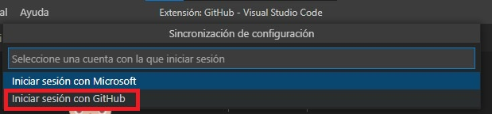

<cite style="display:block; text-align: justify">Luego que seleccionemos iniciar sesión con GitHub nos abrirá una ventana en nuestro navegador preterminado, donde autorizaremos el acceso de Visual Studio Code a GitHub.</cite>

<cite style="display:block; text-align: justify">En esta parte vamos a iniciar sesión con nuestros datos de GitHub.</cite>

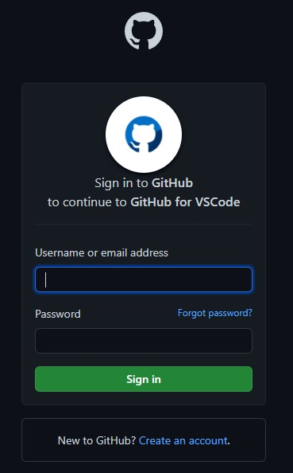

<cite style="display:block; text-align: justify">Cuando iniciamos sesión nos volverá a pedir autorización, la cual vamos a otorgar.</cite>

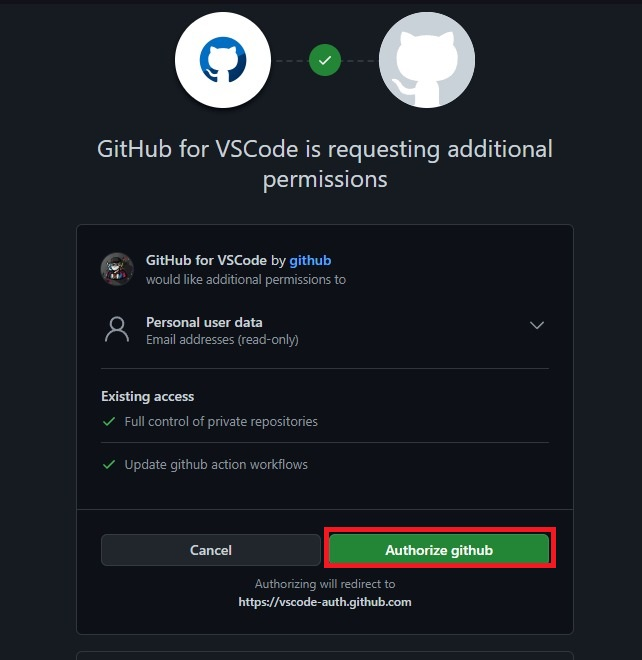

<cite style="display:block; text-align: justify">Nos mostrara esta ventana donde vamos a permitir que abra el Visual Studio Code.</cite>

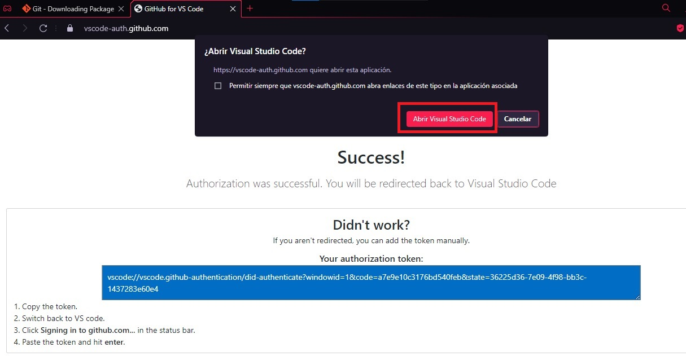

<cite style="display:block; text-align: justify">Luego nos saldrá esta ventana donde vamos a permitir que se ejecute la extensión.</cite>

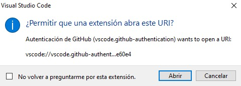

# <b>Comprobación</b>

<cite style="display:block; text-align: justify">Para verificar que nuestro Visual Studio Code si esta sincronizado con el Github, vamos copiar la URL de un repositorio el cual ya hemos creado anteriormente.</cite>

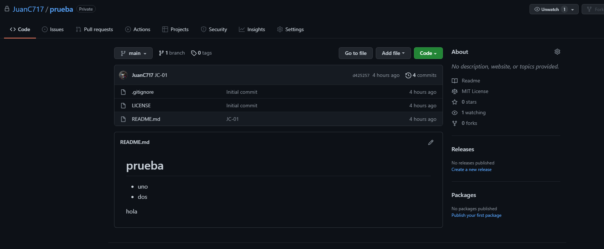

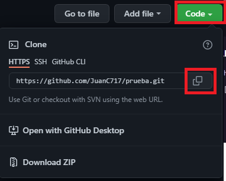

<cite style="display:block; text-align: justify">El la parte de "Explorador" nos saldra una opcion de Clonar Repositorio.</cite>

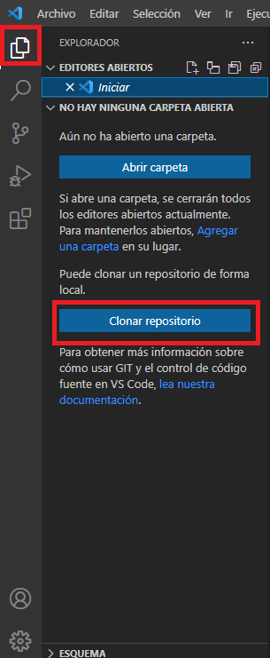

<cite style="display:block; text-align: justify">Le daremos Clic a ese botón y nos dejara introducir la URL del repositorio con el cual queremos trabaja.</cite>

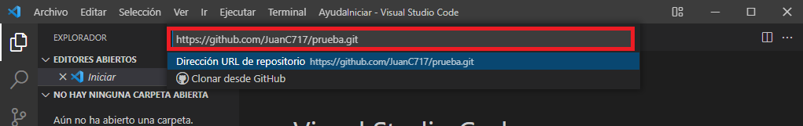

<cite style="display:block; text-align: justify">Nos preguntara en donde queremos que nuestro repositorio cree la carpeta de forma local en nuestro equipo.</cite>

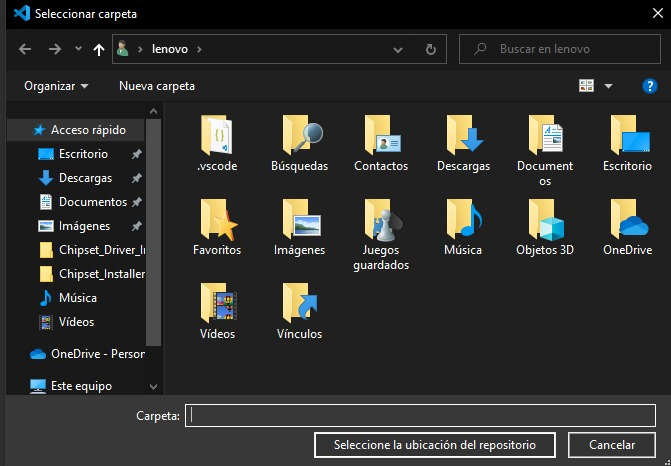

<cite style="display:block; text-align: justify">En la parte inferior derecha nos saldrá esto, lo cual nos indica el proceso de clonación del repositorio.</cite>

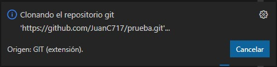

<cite style="display:block; text-align: justify">Aparecerá una ventana la cual nos pedirá que iniciemos sesión con la cuenta de GitHub, esto solo lo pedirá por primera vez.</cite>

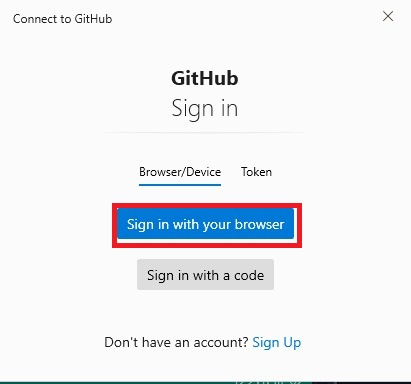

<cite style="display:block; text-align: justify">Le damos en autorizar.</cite>

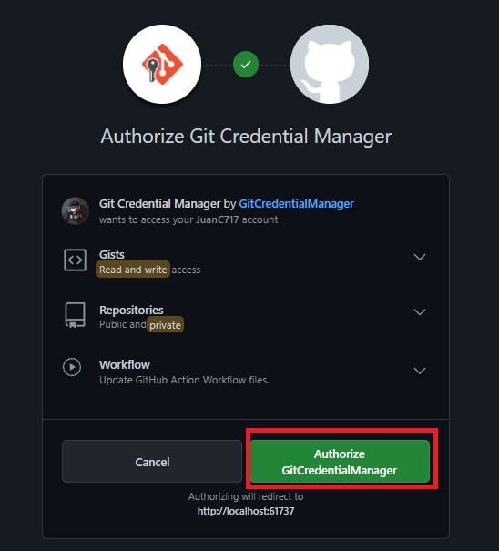

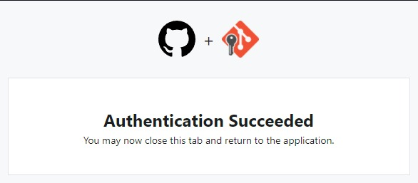

<cite style="display:block; text-align: justify">Una ves autorizamos el acceso, en el programa de visual nos monstrara en la parte inferior derecha este anuncio el cual no indica que se deseamos abrir el repositorio clonado, lo cual vamos a acceder, dando click en Abrir.</cite>

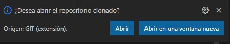

<cite style="display:block; text-align: justify">Luego nos saldrá esta ventana la cual vamos en darle al botón que esta en Azul</cite>

<cite style="display:block; text-align: justify">Una vez hecho todos los pasos anteriores ya podremos trabajar en nuestro proyecto y todo los cambios que se hagan los vamos a poder subir a travez de "commits"</cite>

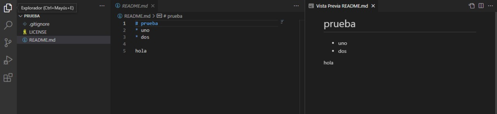

<cite style="display:block; text-align: justify">Comenzamos hacer cambios para ver si nos deja crear los "Commits" correctamente.

Podemos ver que en la parte Izquierda del visual en la parte de <b>Control de código fuente nos aparece un apartado de cambios, esos son los cambios que hemos realizado hasta el mosmento en nuestro repositorio.

En la parte derecha nos muestra la vista previa en el lateral, es decir nos da una visualización de como van quedando nuestros cambios.</b></cite>

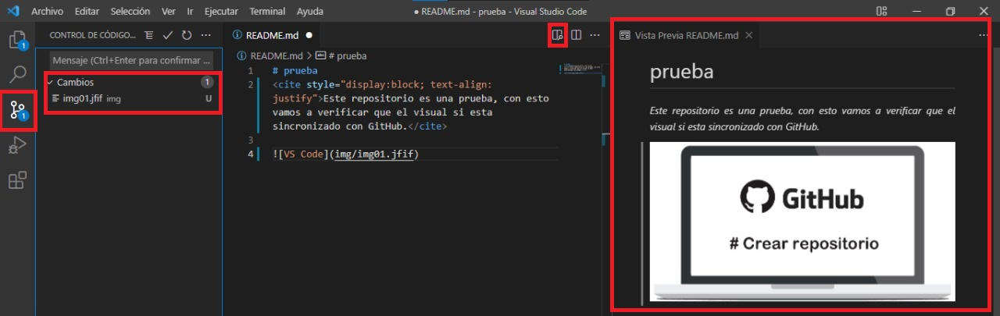

<cite style="display:block; text-align: justify">Escribimos como queremos guardar el "Commit" y le damos en listo.</b></cite>

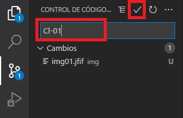

